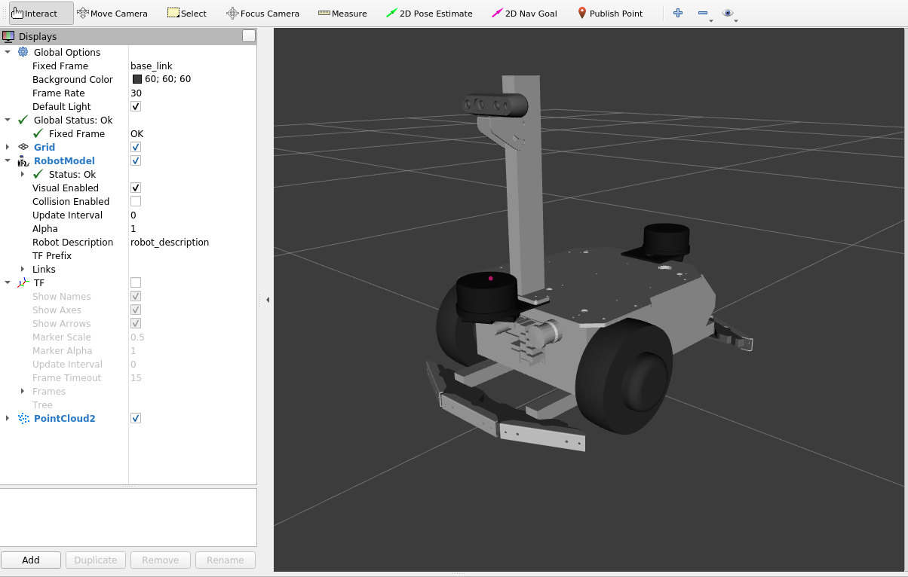

# メガローバーの3Dモデルのパッケージ



## 準備
ヴイストンの台車ロボットのオプションを表示する場合は、`vs_rover_options_description`というパッケージを`src`フォルダーにクローンしてください。（詳細は[こちら](https://github.com/vstoneofficial/vs_rover_options_description.git)を参照してください）
```bash
git clone -b $ROS_DISTRO https://github.com/vstoneofficial/vs_rover_options_description.git
```
> 1. 対応するオプション
>   - LRF TG30
>   - バンパーセンサ（メガローバー：前後）
>   - デプスカメラ　Realsense D435i
>   - カメラステー
> 
> 2. 使用状況に応じて、[mega3.xacro](./urdf/mega3.xacro), [f120a.xacro](./urdf/f120a.xacro)ファイルの6~18行目にある使用しないオプションをコメントアウトしてください。
> 
## 構成

- `urdf/`
  - 各ロボットの Xacro、Gazebo 用定義、ros2_control 用定義
- `meshes/`
  - 3D モデル
- `launch/`
  - RViz 表示用 launch
- `rviz/`
  - RViz 設定ファイル
- `params/`
  - ros2_control のコントローラ設定
- `scripts/`
  - 補助ノードや設定ファイル


## RViz上の可視化

ロボットモデルを表示します。`rover:=` で機種を切り替えます。

```bash
ros2 launch megarover_description display.launch.py rover:=mega3
```

`rover:=` で指定できる値:
- `mega3`
- `f120a`
- `s40a_lb`

### メガローバーVer 3.0を表示する場合:
```bash
ros2 launch megarover_description display.launch.py rover:=mega3
```


### F120Aを表示する場合:
```bash
ros2 launch megarover_description display.launch.py rover:=f120a
```


### S40A_LBを表示する場合:
```bash
ros2 launch megarover_description display.launch.py rover:=s40a_lb
```